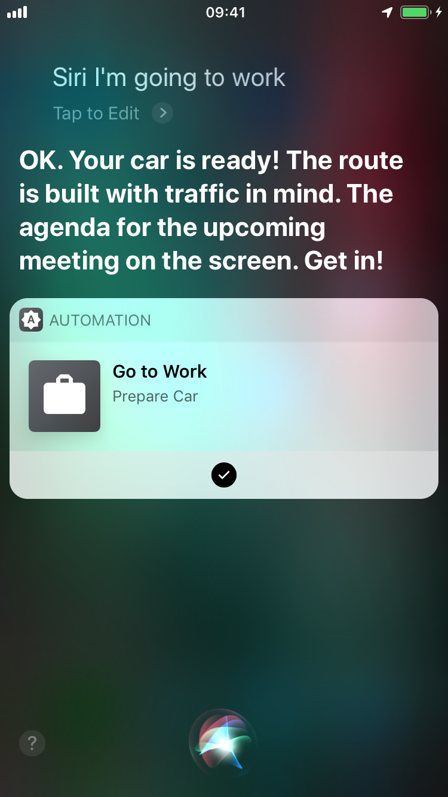

# Demo app for the __High Mobility Hack__ hackathon

## Description

App for integration with _Apple Siri_ to be able to use it with the Voice Assistant or Siri Shortcuts and automate your day to day tasks. You don't even need any user interface. As a demo, it supports only one scenario - Preparing a car to go to work.

The idea and implementation are finished by [Ilya Gruzhevski](https://github.com/ilyagru) in 24 hours participating in [Tallinn Mobility Hack](https://mobilityhack.splashthat.com).

The business presentation (pitch) could be shared on demand.

## How it works

Video is in the repo.

## The flow

1. Say "Siri, I'm going to work".
2. The commands are sent to the car and it will be prepared (engine on, lights active, doors unlocked, agenda on the car's screen, navi destination, etc.).
3. Siri says "Your car is ready".

## Instructions

 - [High Mobility Platform](https://high-mobility.com/get-started)
 - [HM Documentation](https://high-mobility.com/learn)
 - [iOS Releases](https://github.com/highmobility/hm-ios-sdk/releases)
 - [Apple SiriKit](https://developer.apple.com/documentation/sirikit)
 - [Demo App with Intents from Apple](https://developer.apple.com/documentation/sirikit/soup_chef_accelerating_app_interactions_with_shortcuts)

## License

HM frameworks are licensed under
[Apache-2.0](https://github.com/ilyagru/Space-Snake/blob/master/LICENSE).
